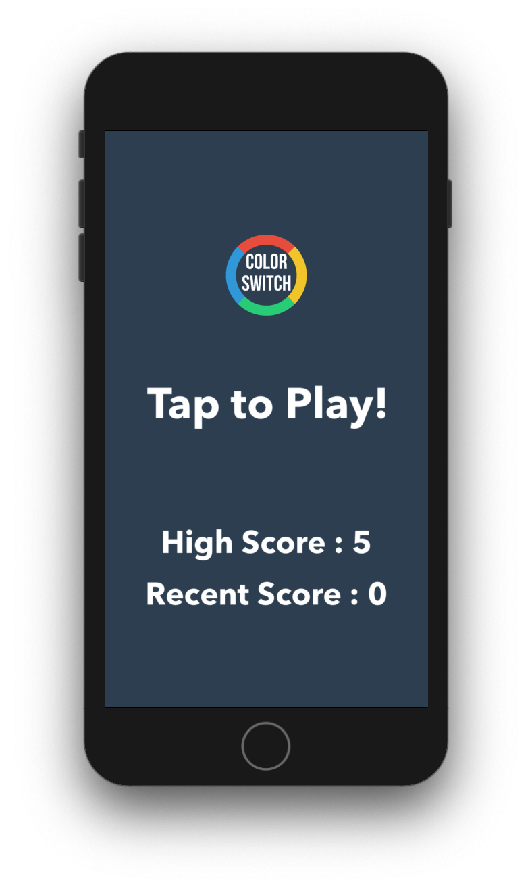
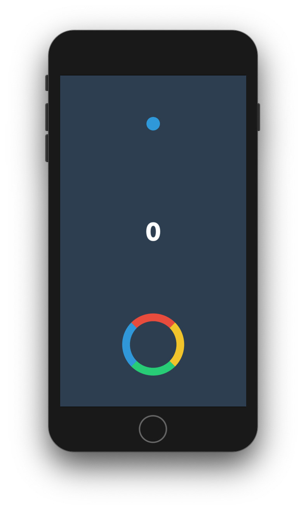

# Color Switch

## Overview

Color Switch is a game built using Swift and SpriteKit! Your goal is to match the color of the wheel to the falling ball to increase your points. The app incorporates:

- Swift
- SpriteKit
- SKPhyics
- SKSpriteNodes

## Getting Started

> This app is not available on the App Store.

### Prerequisites

- A Mac running macOS
- Xcode

### Installation

1. Clone or download the project to your local machine
2. Open the project in Xcode
3. Run the simulator
